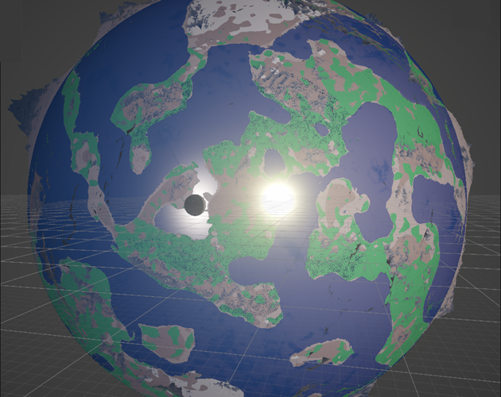
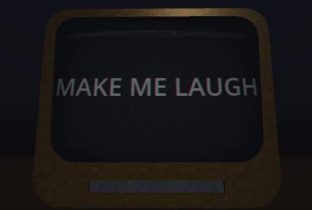
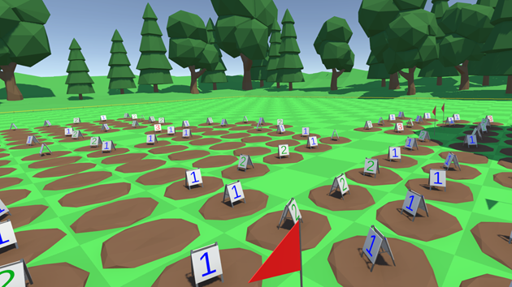
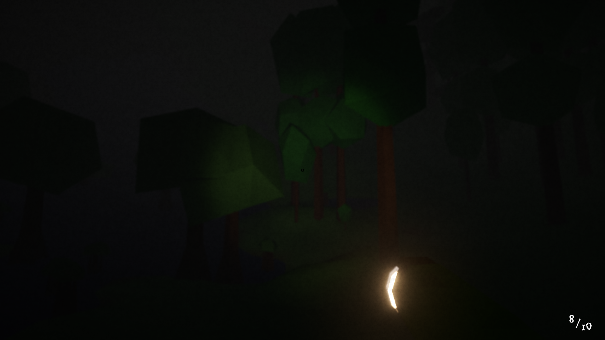
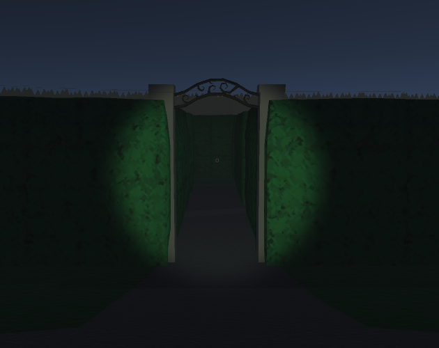
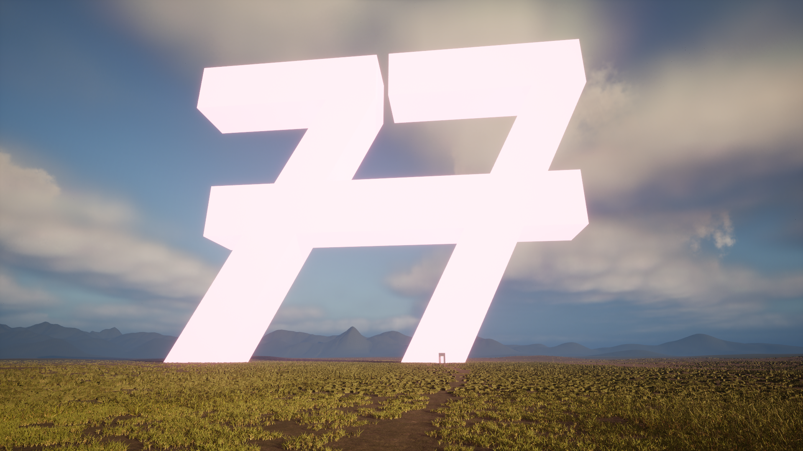
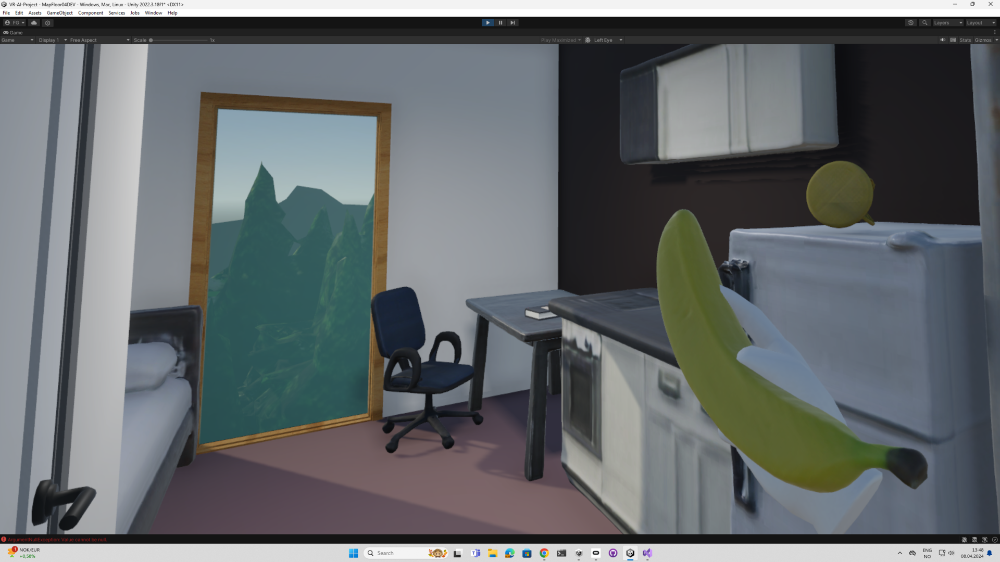
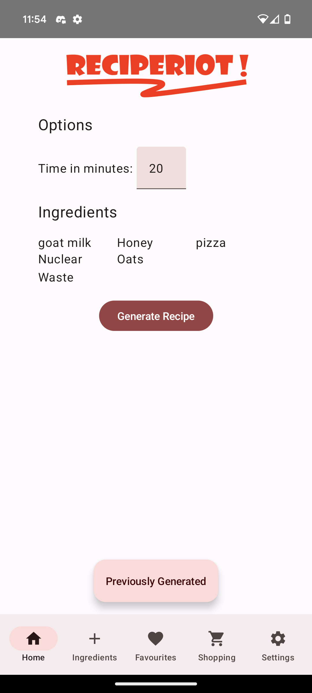
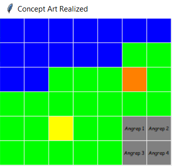
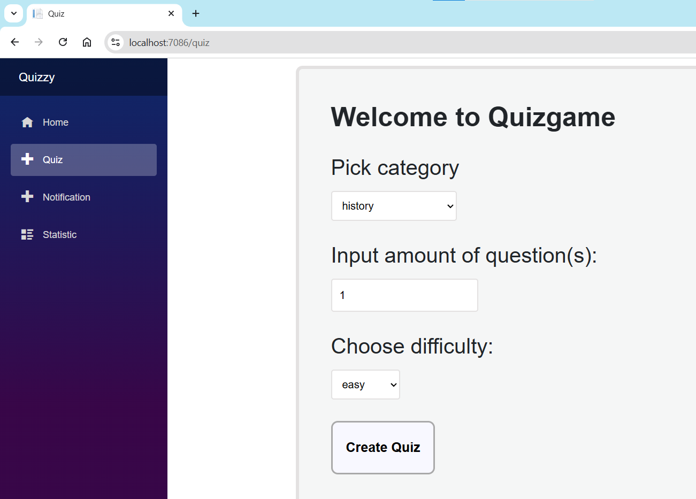

# Ole Marcus Løve Hansen

<table>
  <!--<tr>
    <th colspan="2"><h2>Game Dev Projects</h2></th>
  </tr>-->
  <tr>
    <td>
      <h3>Firmament Prototype</h3>
      A prototyping project in Unity featuring a hollow globe. The world uses a fibonacci-sphere approximation to create a grid-based environment, with multiple layers of 3D perlin noise to create randomized terrain. Objects such as trees and rocks are placed using a combination of 3D perlin noise, latitude, and altitude. There is a gravitational pull away from the world center, and more local gravitation towards the centre sun and moon. A player can walk around the world and interact with objects. A LOD system is in place to decrease quality of and despawn far objects, and only load terrain collision near the player.
      <ul>
        <li><a href="https://github.com/OleMarcusHansen/HollowEarth_Prototyping">GitHub</a></li>
        <li><a href="https://lavatsj-games.itch.io/firmament-prototype">Itch.io</a></li>
      </ul>
    </td>
    <td></td>
  </tr>
  <tr>
    <td></td>
    <td>
      <h3>Make GPT Laugh</h3>
      A small game made with Godot for Global Game Jam 2024 updated to use a local LLM (Qwen by default), previously using OpenAIs ChatCompletions API. In a (not so) distant future, AIs such as ChatGPT has taken over the world, and has enslaved all humans to perform tasks for them. Play as a human given the task of making GPT laugh, being provided only a small set of random words to string together as you please. If GPT does not find your joke funny enough, you will be promptly replaced. 
      <ul>
        <li><a href="https://github.com/OleMarcusHansen/GGJ-GPTChat">GitHub</a></li>
        <li><a href="https://globalgamejam.org/games/2024/make-gpt-laugh-5">GlobalGameJam</a></li>
      </ul>
    </td>
  </tr>
  <tr>
    <td>
      <h3>Mineclearer VR</h3>
      A VR game demo made with Unity for the Meta Quest 2-3. A standard minesweeper board is generated, with the ability to move around it in VR. Tiles can be either stepped on or poked with a stick, and suspected mines can be marked with a flag. 
      <ul>
        <li><a href="https://lavatsj-games.itch.io/mineclearer-vr-demo">Itch.io</a></li>
        <li><a href="https://store.steampowered.com/app/2928930/Mineclearer_VR">Steam</a></li>
      </ul>
    </td>
    <td></td>
  </tr>
  <tr>
    <td></td>
    <td>
      <h3>Spooky Firmament</h3>
      A small "collect my pages" horror game made with Unity in a hollow globe for halloween 2024. Based on the my inverted globe prototyping project, i added a simple monster that chases the player as they run around the world trying to collect all the pages. 
      <ul>
        <li><a href="https://lavatsj-games.itch.io/spooky-firmament-collect-my-pages">Itch.io</a></li>
        <li><a href="https://github.com/OleMarcusHansen/HollowEarth_Prototyping">GitHub</a></li>
      </ul>
    </td>
  </tr>
  <tr>
    <td>
      <h3>Spooky Maze games</h3>
      Three horror games made with Unity, each made within a single month. These started as a challenge for myself to fully create and publish a small spooky game for Halloween, to get out of the comfort of only working in the starting phase of projects and never finishing them. The first game therefore includes some downloaded assets, while the later two includes mostly self made assets like most of my other projects. 
      <ul>
        <li><a href="https://lavatsj-games.itch.io/spooky-maze-collection">Itch.io</a></li>
      </ul>
    </td>
    <td></td>
  </tr>
  <tr>
    <td></td>
    <td>
      <h3>77th: The Game</h3>
      A puzzle game made with Unreal Engine 5. Starting as a project to make myself familiar with Unreal Engine, the game features a small variety of maps and features, and a mix of imported and self-made assets. After about six months of development, the game was posted for free on Itch.io, and was later after about 2 months of further work posted for free on Steam. 
      <ul>
        <li><a href="https://store.steampowered.com/app/2619110/77th_The_Game/">Steam</a></li>
        <li><a href="https://lavatsj-games.itch.io/77th-the-game">Itch.io</a></li>
      </ul>
    </td>
  </tr>
  <!--<tr>
    <th colspan="2"><h2>Student Projects</h2></th>
  <tr>-->
  <tr>
    <td>
      <h3>VR + AI = True?</h3>
      A prototype made along our bachelor thesis using Unity and various generative AI services. The project explores how generative AI can be used to increase user experience through personalisation. This is achieved by generating content during runtime based on previous user interactions. The project had a focus on exploring new features of personalisation that would be hard to replicate without generative AI, as opposed to simply replacing human made assets. 
      <ul>
        <li><a href="https://youtu.be/rg9UVIDEnQE">Youtube</a></li>
        <li><a href="https://www.hiof.no/iio/om/expo/prosjekter-2024/utvidet-virkelighet/b24itk49/">HIOF</a></li>
      </ul>
    </td>
    <td></td>
  </tr>
  <tr>
    <td align="center"></td>
    <td>
      <h3>RecipeRiot</h3>
      An app utilizing OpenAI's APIs and a Firebase database to generate and store recipes for a course in mobile programming. The user can input and save the ingredients they own, select the ingredients they would like to use, and have a recipe generated. Each recipe includes a generated description, an image, step-by-step instructions, and nutritional content. 
      <ul>
        <li><a href="https://github.com/OleMarcusHansen/RecipeRiot">GitHub</a></li>
      </ul>
    </td>
  </tr>
  <tr>
    <td>
      <h3>Jellygame Engine</h3>
      A 2D game engine framework made with Python as a student project for a course in frameworks. Featuring tile-based rendering, sprites, text, input-handling and audio. The tile-based system allows for a grid of tiles to be rendered. Each tile can have assigned attributes, and has a slot for a gameobject (called a Jelly) that can be placed and rendered on top of the tile. A Jelly can have assigned attributes, has a slot to hold another Jelly on top, and can be moved around to different tiles on the grid. As the course was rather process oriented and this was our first time designing a framework, the resulting game engine is not a tool we would recommend to use in its current state. Following a Scenario Driven Design process, we learnt alot and had a lot of fun working on this project. 
      <ul>
        <li><a href="https://github.com/OleMarcusHansen/jellygame">GitHub</a></li>
      </ul>
    </td>
    <td></td>
  </tr>
  <tr>
    <td></td>
    <td>
      <h3>CarEx</h3>
      A project made with Java for a course in Software Engineering and Testing. It is a demo program for peer-to-peer car rental, using Swing for the GUI and JSON to save data locally. 
      <ul>
        <li><a href="https://github.com/OleMarcusHansen/SoftwareEngineeringAndTesting">GitHub</a></li>
      </ul>
    </td>
  </tr>
  <tr>
    <td>
      <h3>Quizzy</h3>
      A project made for a course in .NET. It is a trivia quiz website, including a bunch of microservices for question retrieval, user accounts, account data, and notifications. 
      <ul>
        <li><a href="https://github.com/OleMarcusHansen/TriviaDotNet">GitHub</a></li>
      </ul>
    </td>
    <td></td>
  </tr>
</table>

<!--
|  |  |
|---|---|
| A prototyping project in Unity featuring a hollow/inverted globe   - [HollowEarth Prototype](https://github.com/OleMarcusHansen/HollowEarth_Prototyping) |  |
|  | A small game made with Godot for Global Game Jam 2024   - [GGJ-MakeGPTLaugh](https://github.com/OleMarcusHansen/GGJ-GPTChat) |
| A VR-game demo made with Unity   - [Mineclearer VR (Itch page)](https://lavatsj-games.itch.io/mineclearer-vr-demo) |  |
|  | A small spooky/horror game made with Unity in a hollow/inverted globe   - [Spooky Firmament (Itch page)](https://lavatsj-games.itch.io/spooky-firmament-collect-my-pages) |
| Three spooky/horror games made with Unity   - [Spooky Maze Games (Itch page)](https://lavatsj-games.itch.io/spooky-maze-collection) |  |
|  | A game made with Unreal Engine 5   - [77thTheGame (Steam page)](https://store.steampowered.com/app/2619110/77th_The_Game/) |
-->

<!--
## Game Dev Projects
- [HollowEarth Prototype](https://github.com/OleMarcusHansen/HollowEarth_Prototyping) - A prototyping project in Unity featuring a hollow/inverted globe
- [GGJ-MakeGPTLaugh](https://github.com/OleMarcusHansen/GGJ-GPTChat) - A small game made with Godot for Global Game Jam 2024
- [Mineclearer VR (Itch page)](https://lavatsj-games.itch.io/mineclearer-vr-demo) - A VR-game demo made with Unity
- [Spooky Firmament (Itch page)](https://lavatsj-games.itch.io/spooky-firmament-collect-my-pages) - A small spooky/horror game made with Unity in a hollow/inverted globe
- [Spooky Maze Games (Itch page)](https://lavatsj-games.itch.io/spooky-maze-collection) - Three spooky/horror games made with Unity
- [77thTheGame (Steam page)](https://store.steampowered.com/app/2619110/77th_The_Game/) - A game made with Unreal Engine 5

## Student Projects
- [VR+AI Demo Video (Youtube)](https://youtu.be/rg9UVIDEnQE) - A prototype made along our bachelor thesis using Unity
- [RecipeRiot](https://github.com/OleMarcusHansen/RecipeRiot) - An app utilizing OpenAIs ChatCompletions to generate recipes
- [Jellygame](https://github.com/OleMarcusHansen/jellygame) - A game engine framework made with Python
- [SoftwareEngineering](https://github.com/OleMarcusHansen/SoftwareEngineeringAndTesting) - A project made with Java for a course in Software Engineering and Testing
- [TriviaDotNet](https://github.com/OleMarcusHansen/TriviaDotNet) - A project made for a course in .NET
-->

<!--[VR-AI-Experience](https://github.com/OleMarcusHansen/VR-AI-Experience)-->

